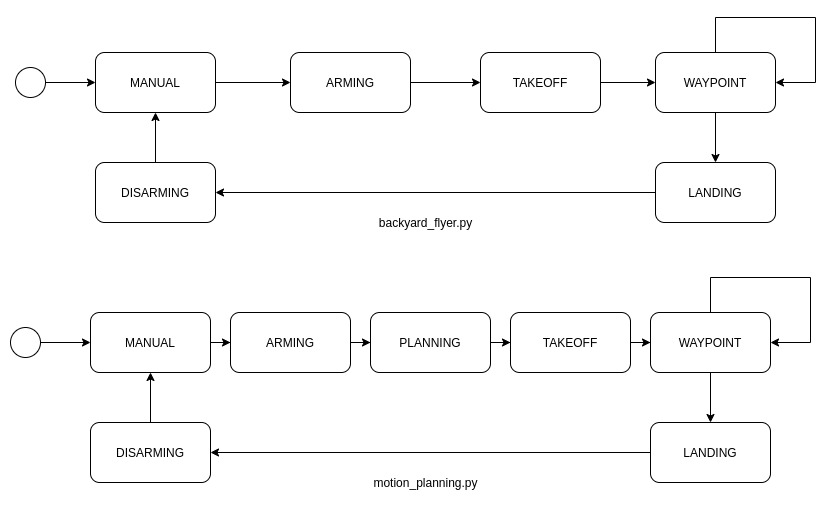
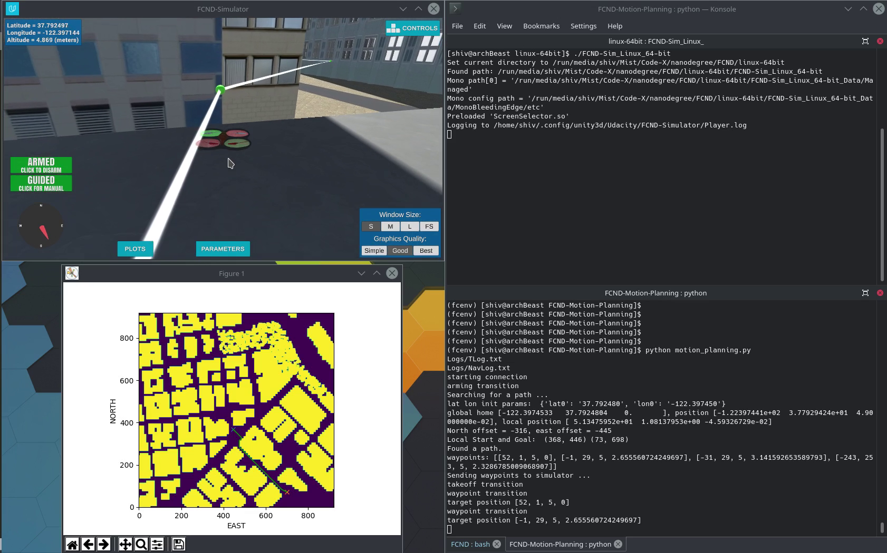
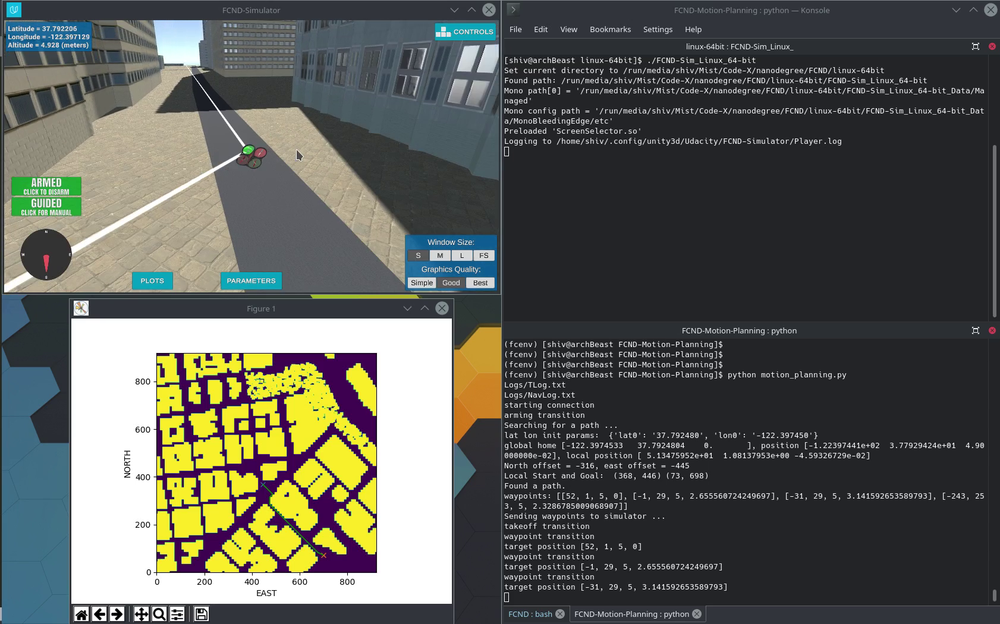

## Project: 3D Motion Planning

---

# Required Steps for a Passing Submission:
1. Load the 2.5D map in the colliders.csv file describing the environment.
2. Discretize the environment into a grid or graph representation.
3. Define the start and goal locations.
4. Perform a search using A* or other search algorithm.
5. Use a collinearity test or ray tracing method (like Bresenham) to remove unnecessary waypoints.
6. Return waypoints in local ECEF coordinates (format for `self.all_waypoints` is [N, E, altitude, heading], where the drone’s start location corresponds to [0, 0, 0, 0].
7. Write it up.
8. Congratulations!  Your Done!

## [Rubric](https://review.udacity.com/#!/rubrics/1534/view) Points
### Here I will consider the rubric points individually and describe how I addressed each point in my implementation.  

---
### Writeup / README

#### 1. Provide a Writeup / README that includes all the rubric points and how you addressed each one.  You can submit your writeup as markdown or pdf.  

You're reading it! Below I describe how I addressed each rubric point and where in my code each point is handled.

### Explain the Starter Code

#### 1. Explain the functionality of what's provided in `motion_planning.py` and `planning_utils.py`

## `planning_utils.py`
srNo | function | description |
--- | --- | --- |
1 | fn create_grid| this function takes in data read from csv about obstacles and for each obstacle  |
2 | fn valid_actions| this function takes in grid and current node(position) and tell valid actions for given node(position) on a grid.|
3 | fn a_star| a* algorithm is a popular search algorithm used for path finding and graph traversal. this takes in grid, heuristic function and start and goal positions. at each node it sees all possible actions and takes one which leads closer to the goal using heuristic and cost. It keeps track of each node it has explored and doesnt re exlore same node. once it reaches the goal it retraces the path backwords and returns the path. |
4 | fn heuristic| this function takes in 2 positions and calculates heuristic between them. implementation uses euclidean distance as hiuristic|
5 | class Action| defines all possible actions, cost for the action and delta to be applied if the action is chosen|

## `motion_planning.py`

`motion_planning.py` is modified version of `backyard_flyer.py`.  `backyard_flyer.py` has predefined path while `motion_planning.py` plans a path based on start position and goal position. For this it has extra planning state. Here we preplan the path and execute whole at once. 
`motion_planning.py` has 3 callback function and state transition functions which handles the function of each state.

srNo | function | description |
--- | --- | --- |
1 |state_callback| this callback handles task of activating and deactivating the drone|
2 |local_position_callback| this callback handles task of guiding the drone. Detection of when the drone has reached a waypoint happens in this |
3 |velocity_callback| drone landing detection happens in this callback|
4 |arming_transition|this arms the drone|
5 |takeoff_transition|handles take off transition|
6 |waypoint_transition| sets a way point and commnads drone towards it|
7 |landing_transition|handles landing transition|
8 |disarming_transition|disarms the drone|
9 |manual_transition|put the drone in manual mode and turns it off|
10|plan_path|this function handles all the planning of drones path from start position to goal position.|

## `fn plan_path`
- Load the 2.5D map in the `colliders.csv` file describing the environment.
- Discretize the environment into a grid or graph representation.
- Define the start and goal locations.
- Perform a search using diagonal A* 
- Use a collinearity test and ray tracing method (Bresenham) to remove unnecessary waypoints.
- Return waypoints in local ECEF coordinates (format for `self.all_waypoints` is [N, E, altitude, heading], where the drone’s start location corresponds to [0, 0, 0, 0]). 

### Implementing Your Path Planning Algorithm

#### 1. Set your global home position
The starter code assumes drones initial position as the global home. we have set this position as the latitude-longitude we read fromthe file (`colliders.csv`). we read the first line of the csv file, extract lat0 and lon0 as floating point values and use the self.set_home_position() method to set global home.

this is done in `motion_planning.py` [line 128-137](motion_planning.py#L128-L137) .

#### 2. Set your current local position
We convert drones global postion into local position relative to global home. 
This is done in `motion_planning.py` [line 143](motion_planning.py#L143) .

#### 3. Set grid start position from local position
We use th local position offset it with the grid and set start position.
This is done in `motion_planning.py` [line 154](motion_planning.py#L154) .

#### 4. Set grid goal position from geodetic coords
I have provided 2 ways to set grid goal.
1. by providing lat long altitude
try  `python motion_planning.py --goal '-122.40195876, 37.79673913, -0.147'`
if `--goal` parameter is passed we check if it has all 3 parameters (lat, lon, alt), extract it as float and converts it into local_position and sets grid_goal. `motion_planning.py` [line 240-253](motion_planning.py#L240-L253) and [line 159-163](motion_planning.py#L159-L163) 

2. if goal state is not specified, i randomly sample till i find location which is not inside any colliders. and set it as goal position.
`motion_planning.py` [line 168-173](motion_planning.py#L168-L173) 

#### 5. Modify A* to include diagonal motion (or replace A* altogether)
I have added diagonal states (NORTH_WEST, NORTH_EAST, SOUTH_WEST, SOUTH_EAST) `planning_utils.py` [line 59-62](planning_utils.py#L59-L62)
valid actions for this states are determined in `planning_utils.py` [line 93-100](planning_utils.py#L93-L100)

#### 6. Cull waypoints 
For this step I have used a collinearity test and ray tracing method Bresenham. The idea is simply to prune your path of unnecessary waypoints. 

In `motion_planning.py` i call the prun function and pass grid and path found by a* algo [line 159-163](motion_planning.py#L159-L163). Inside prun function i do collinearity check which is defined in `planning_utils.py` [line 167-170](planning_utils.py#L167-L170). After collinearity i use Bresenham library to do ray tracing.

Prun function is defined in `planning_utils.py` [line 182-201](planning_utils.py#L182-L201).

### Heading
I am also setting heading command. As told in `readme.md`
`motion_planning.py` [line 187-197](motion_planning.py#L187-L197)

### MAP
On computing the path i also pop a plot showing map with the computed path
`motion_planning.py` [line 201-212](motion_planning.py#L201-L212). 

### INFO
If the goal state is set way far it might take some time to compute the path. hence i have changed the timeout to 3 minutes. `motion_planning.py` [line 256](motion_planning.py#L256). 

### Execute the flight
#### 1. Does it work?
It works!

### Double check that you've met specifications for each of the [rubric](https://review.udacity.com/#!/rubrics/1534/view) points.
  
# Extra Challenges: Real World Planning

For an extra challenge, consider implementing some of the techniques described in the "Real World Planning" lesson. You could try implementing a vehicle model to take dynamic constraints into account, or implement a replanning method to invoke if you get off course or encounter unexpected obstacles.

